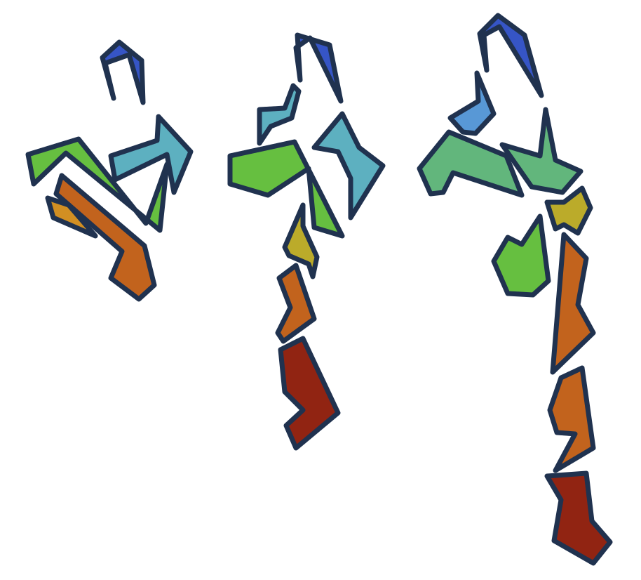

Flipbook trajectory analysis
============================

RMSX partitions a molecular dynamics trajectory into time slices and computes
per-residue RMSF within each slice. This Galaxy wrapper exposes the RMSX compute
path and returns workflow-friendly Galaxy datasets: per-chain collections of
RMSX, RMSD, RMSF, and mask metadata tables; a combined list collection of PDB
slice snapshots; per-chain RMSX heatmap and RMSD/RMSX/RMSF triple-plot
collections; an execution log; and one schema-validated JSON manifest for the
native Galaxy Molstar Flipbook viewer.

Scope
-----

The Tool Shed candidate is a Flipbook Galaxy wrapper backed by RMSX. The tool
performs the analysis and emits a typed viewer manifest; Galaxy launches the
native Molstar visualization from that output through its Visualize action.
The wrapper does not require ChimeraX, VMD, an external viewer server, or a
trusted HTML report.

The first reviewable wrapper path accepts PDB topology/structure input and DCD
or XTC trajectory input. RMSX and MDAnalysis can support additional molecular
dynamics formats, but broader Galaxy datatype coverage should be added
deliberately with tests for each supported pair.

The wrapper analyzes every valid protein segment by default. Users can instead
choose one or more comma-separated chain or segment IDs. RMSX is invoked once
per selected segment through its public Python API, the static plots share one
global RMSX color range, and the combined Molstar manifest preserves residue
identity as ``chain:residue``.

Viewer manifest
---------------

The Molstar Flipbook manifest uses schema version
``flipbook-molstar-viewer/v1`` and is emitted as typed Galaxy ``rmsx.json``.
That datatype makes the manifest a first-class visualization-ready output
instead of arbitrary JSON. The datatype and native visualization registration
are proposed upstream in ``galaxyproject/galaxy#23009``. The packaged viewer
was merged in ``galaxyproject/galaxy-visualizations#174`` and is published as
``@galaxyproject/rmsxflipbook@0.0.2``.

The schema version remains unchanged for the reference-style Analysis view.
New manifests optionally include per-chain RMSD and RMSF arrays, one shared
time domain, per-slice time bounds, and ``chainAtomRanges``. RMSD is reduced to
at most 2,048 chronological min/max-bin points while retaining the first,
last, and global extrema; all RMSF residues are retained in source order.
Older viewers ignore these optional fields, and newer viewers fall back to a
compact heatmap/structure Analysis layout when they are absent.

While assembling combined PDB slices, the wrapper writes an internal logical
chain index. This preserves multi-character segment identities such as
``SYSTEM`` even though a PDB chain field can hold only one character. The
index is consumed while generating the manifest and is not exposed as a
separate Galaxy history output.

Dependency status
-----------------

The wrapper currently declares only the public, pinned runtime image
``ghcr.io/antuneslab/flipbook-galaxy:0.2.3-galaxy0``. The image contains RMSX,
MDAnalysis, the Python table stack, and the complete R plotting stack. It is
built from RMSX Git tag ``v0.2.3``; that tag's ``pyproject.toml`` still reports
``rmsx==0.1.0``, which is why the Galaxy tool version and version command report
``0.1.0``. A Bioconda recipe is intended as follow-up packaging work; until it
exists, undeclared or unresolvable Conda requirements are deliberately omitted.

The Galaxy runtime path must not install R packages at job runtime. The
container and future Conda recipe should preinstall the R stack and tests should
exercise plotting without network access.

Publication notes
-----------------

* The bundled XTC fixture preserves all 316 frames from the original demo
  trajectory while staying below the community repository's 1 MB file-size
  check. Its
  source, redistribution terms, checksums, and regeneration command are
  recorded in ``test-data/README.md`` and ``test-data/LICENSE.md``. Repository
  maintainers should confirm that the educational-use terms are acceptable for
  bundled test data.
* ``galaxyproject/galaxy#23009`` merged into Galaxy ``dev`` and provides the
  ``rmsx.json`` datatype and native visualization registration. This wrapper's
  community CI therefore tests against ``dev`` until that code reaches
  a Galaxy release branch.
* The pinned GHCR runtime is public and has been verified with an anonymous
  pull.
* The Galaxy wrapper references the registered bio.tools identifier
  ``rmsx_and_flipbook``.
* Upstream RMSX release metadata should be reconciled so the tag, package
  version, and Galaxy wrapper version tell the same story.
* Test-data provenance and the full transitive dependency license inventory
  should be kept with the review packet.

License
-------

This wrapper repository is MIT licensed. The bundled trajectory fixture is
third-party educational material and is explicitly excluded from the MIT grant;
see ``test-data/LICENSE.md``. Upstream RMSX and Molstar are MIT licensed, and
MDAnalysis uses LGPL-compatible licensing. The final community review packet
should include transitive license checks for Conda, pip, R, and packaged
JavaScript assets.
